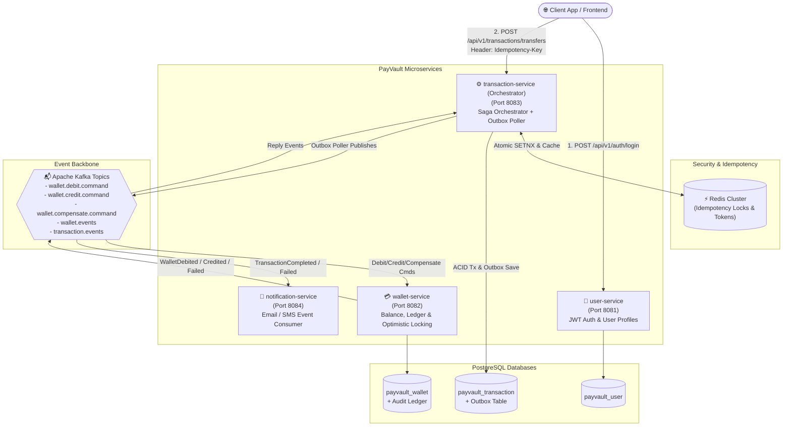
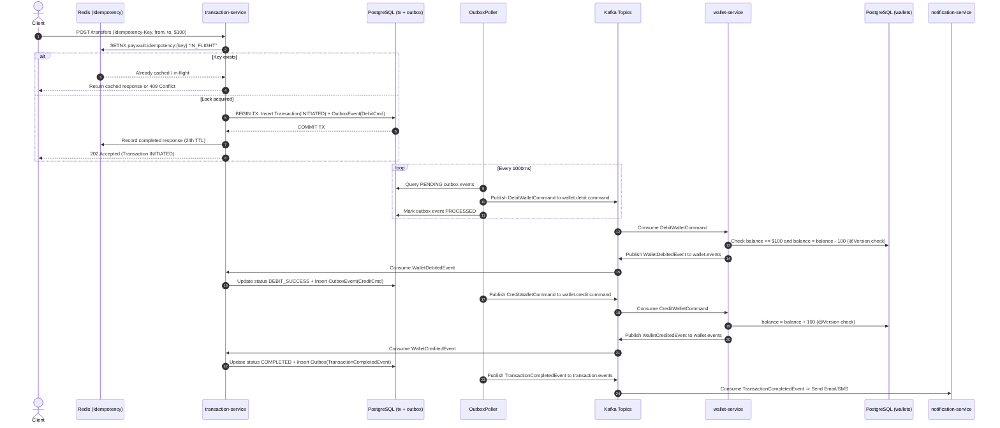
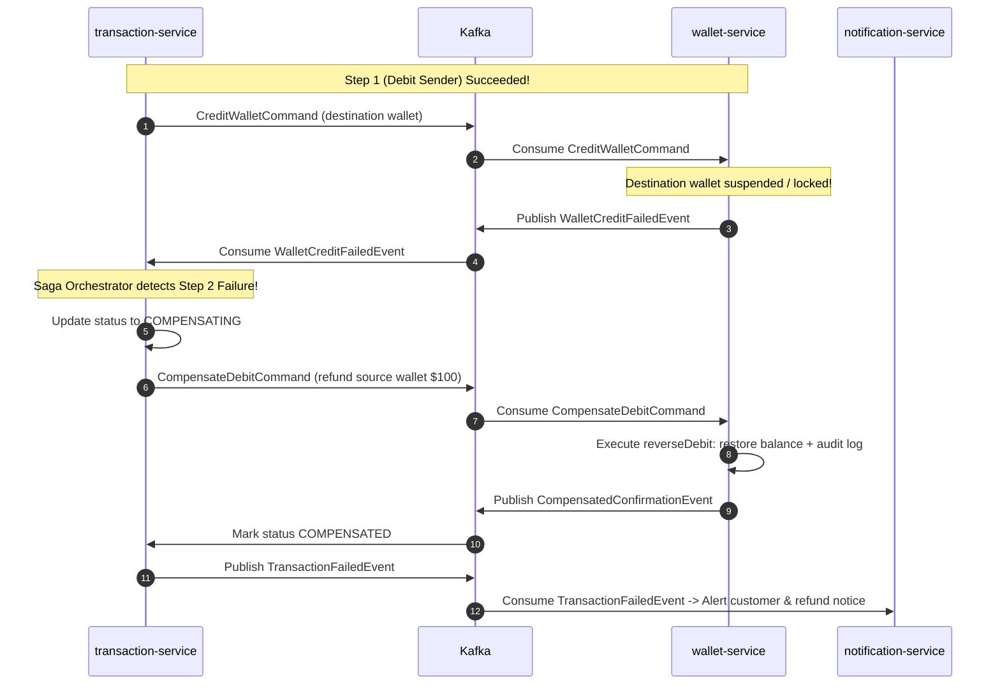

# PayVault — Digital Wallet Payment System

> Production-ready, enterprise-grade multi-module distributed payment engine built with **Java 17**, **Spring Boot 3.3.4**, **Spring Cloud 2023.0.3**, **PostgreSQL**, **Redis**, and **Apache Kafka**.

---

## 🏛️ System Architecture



---

## 🚀 Quick Start — Run with One Command

### Prerequisites
- Docker Engine 24+ and Docker Compose v2+
- Maven 3.9+ & Java 17 (for local builds)

### 1. Build All JARs
```bash
mvn clean package -DskipTests
```

### 2. Boot Infrastructure & Microservices
```bash
docker-compose up --build -d
```

### 3. Check System Health
```bash
docker-compose ps
curl -s http://localhost:8081/actuator/health | jq
curl -s http://localhost:8082/actuator/health | jq
curl -s http://localhost:8083/actuator/health | jq
curl -s http://localhost:8084/actuator/health | jq
```

---

## 🔄 Saga Orchestration & Transactional Outbox Flow

PayVault enforces eventual consistency using an **Orchestrated Saga Pattern** combined with the **Transactional Outbox Pattern** to prevent the Dual-Write anomaly.

### 1. Happy Path Sequence Diagram



---

### 2. Failure & Compensation Sequence Diagram (Saga Rollback)



---

## 🔑 Idempotency Implementation Details

PayVault protects payment initiation against network retries, timeouts, and multi-clicks using a two-phase Redis protocol:

```java
// Snippet from IdempotencyService.java
public Optional<TransferResponse> acquireLockOrGetCached(String idempotencyKey) {
    String redisKey = "payvault:idempotency:" + idempotencyKey;

    // 1. Atomic SETNX (with 60s lock TTL)
    Boolean acquired = redisTemplate.opsForValue().setIfAbsent(redisKey, "IN_FLIGHT", Duration.ofSeconds(60));

    if (Boolean.TRUE.equals(acquired)) {
        return Optional.empty(); // Acquired fresh lock, proceed
    }

    // 2. Already exists: inspect value
    String existingValue = redisTemplate.opsForValue().get(redisKey);
    if ("IN_FLIGHT".equals(existingValue)) {
        throw new IdempotencyConflictException("Request with key '" + idempotencyKey + "' is already in progress.");
    }

    // 3. Return cached historical response
    return Optional.of(objectMapper.readValue(existingValue, TransferResponse.class));
}
```

---

## 📦 Transactional Outbox Pattern Implementation

Prevents the distributed dual-write bug: writing to PostgreSQL and sending to Kafka in separate uncoordinated operations.

```java
// Step 1: In the SAME local database transaction:
transactionRepository.save(transaction);
outboxPublisher.publish("Transaction", txId.toString(), "DebitWalletCommand", debitCommand);

// Step 2: Scheduled Poller reads and dispatches to Kafka
@Scheduled(fixedDelayString = "1000")
@Transactional
public void pollAndPublish() {
    List<OutboxEvent> pending = outboxEventRepository.findTopPendingEvents(PENDING, PageRequest.of(0, 50));
    for (OutboxEvent event : pending) {
        kafkaTemplate.send(topic, event.getAggregateId(), event.getPayload());
        event.setStatus(PROCESSED);
    }
}
```

---

## 🛡️ Optimistic Locking in Wallet Service

To prevent dirty reads and lost balance updates when concurrent transfers occur, `Wallet.java` declares `@Version`:

```java
@Entity
@Table(name = "wallets")
public class Wallet {
    @Id
    private UUID id;

    @Column(precision = 19, scale = 4)
    private BigDecimal balance;

    @Version
    private Long version; // Incremented by JPA on every UPDATE
}
```

If another thread modifies the wallet concurrently, Hibernate detects `version` mismatch and throws `OptimisticLockingFailureException`, which is caught and retried or translated cleanly.

---

## 📡 Key API Endpoints & cURL Samples

### 1. Register User
```bash
curl -X POST http://localhost:8081/api/v1/auth/register \
  -H "Content-Type: application/json" \
  -d '{
    "username": "alice",
    "email": "alice@payvault.io",
    "password": "Password123!",
    "fullName": "Alice Johnson"
  }'
```
**Response (201 Created):**
```json
{
  "id": "a0000000-0000-0000-0000-000000000001",
  "username": "alice",
  "email": "alice@payvault.io",
  "fullName": "Alice Johnson",
  "role": "USER",
  "status": "ACTIVE"
}
```

### 2. Login & Acquire JWT
```bash
curl -X POST http://localhost:8081/api/v1/auth/login \
  -H "Content-Type: application/json" \
  -d '{
    "username": "alice",
    "password": "Password123!"
  }'
```
**Response (200 OK):**
```json
{
  "token": "eyJhbGciOiJIUzI1NiIsInR5cCI6IkpXVCJ9...",
  "tokenType": "Bearer",
  "username": "alice",
  "userId": "a0000000-0000-0000-0000-000000000001"
}
```

### 3. Create Wallet
```bash
curl -X POST http://localhost:8082/api/v1/wallets \
  -H "Content-Type: application/json" \
  -d '{
    "userId": "a0000000-0000-0000-0000-000000000001",
    "currency": "USD"
  }'
```

### 4. Deposit Funds to Wallet
```bash
curl -X POST http://localhost:8082/api/v1/wallets/w0000000-0000-0000-0000-000000000001/deposit \
  -H "Content-Type: application/json" \
  -d '{
    "amount": 500.00
  }'
```

### 5. Check Wallet Balance & Ledger
```bash
curl -X GET http://localhost:8082/api/v1/wallets/w0000000-0000-0000-0000-000000000001
curl -X GET http://localhost:8082/api/v1/wallets/w0000000-0000-0000-0000-000000000001/ledger
```

### 6. Initiate Idempotent Money Transfer
```bash
curl -X POST http://localhost:8083/api/v1/transactions/transfers \
  -H "Content-Type: application/json" \
  -H "Authorization: Bearer <JWT_TOKEN>" \
  -H "Idempotency-Key: idemp-req-8849-xyz" \
  -d '{
    "sourceWalletId": "w0000000-0000-0000-0000-000000000001",
    "destinationWalletId": "w0000000-0000-0000-0000-000000000002",
    "amount": 150.00,
    "currency": "USD"
  }'
```
**Response (202 Accepted):**
```json
{
  "transactionId": "t0000000-0000-0000-0000-000000000001",
  "idempotencyKey": "idemp-req-8849-xyz",
  "sourceWalletId": "w0000000-0000-0000-0000-000000000001",
  "destinationWalletId": "w0000000-0000-0000-0000-000000000002",
  "amount": 150.00,
  "currency": "USD",
  "status": "INITIATED",
  "message": "Transfer successfully initiated. Processing Saga workflow asynchronously."
}
```

### 7. Query Transaction Status
```bash
curl -X GET http://localhost:8083/api/v1/transactions/t0000000-0000-0000-0000-000000000001 \
  -H "Authorization: Bearer <JWT_TOKEN>"
```

---

## 🧪 Testing the Saga Failure & Compensation Scenario

### Scenario 1: Insufficient Balance
1. Attempt to transfer $10,000 from a wallet with only $500:
```bash
curl -X POST http://localhost:8083/api/v1/transactions/transfers \
  -H "Content-Type: application/json" \
  -H "Authorization: Bearer <JWT_TOKEN>" \
  -H "Idempotency-Key: idemp-insufficient-funds-01" \
  -d '{
    "sourceWalletId": "w0000000-0000-0000-0000-000000000001",
    "destinationWalletId": "w0000000-0000-0000-0000-000000000002",
    "amount": 10000.00,
    "currency": "USD"
  }'
```
2. Inspect transaction status after 1-2 seconds:
```bash
curl -X GET http://localhost:8083/api/v1/transactions/<transaction_id> \
  -H "Authorization: Bearer <JWT_TOKEN>"
```
Result: Status transitions to `FAILED` with `failureReason: "Insufficient wallet balance: current=500.0000, requested=10000.00"`. Source wallet remains unchanged.

### Scenario 2: Destination Wallet Failure & Compensating Refund
1. Transfer to a non-existent or suspended destination wallet UUID.
2. Step 1 successfully debits source wallet.
3. Step 2 fails at destination wallet.
4. Saga Orchestrator triggers `CompensateDebitCommand`.
5. Check source wallet ledger: contains both `DEBIT` and `REVERSAL` entries, restoring original balance.
6. Transaction status ends at `COMPENSATED`.

---

## 📊 Resilience4j & Monitoring

- **Circuit Breaker Status:** `http://localhost:8083/actuator/health`
- **Prometheus Metrics:** `http://localhost:8083/actuator/prometheus`
- **Kafka Topics & Lags:** Monitored via standard JMX or Confluent Control Center.
